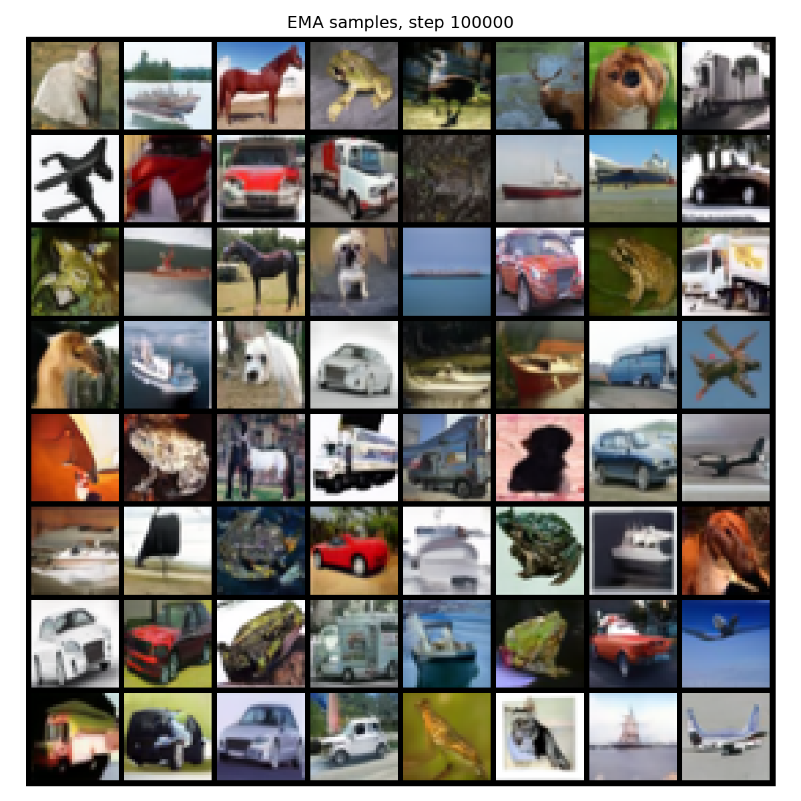

# DDPM on CIFAR-10

Course project for Machine Learning, Faculty of Mathematics, University of Belgrade.

An unconditional [DDPM](https://arxiv.org/abs/2006.11239) trained on [CIFAR-10](https://www.cs.toronto.edu/~kriz/cifar.html). It uses a 1,000-step linear schedule, a 35.75M-parameter U-Net, the simplified noise-prediction objective, EMA weights, and the original DDPM sampler.

The notebooks form the workflow and should be read in numeric order.

## Files

- [`01_dataset.ipynb`](01_dataset.ipynb) — explores CIFAR-10.
- [`02_diffusion.py`](02_diffusion.py) — implements forward and reverse diffusion.
- [`03_forward_noising.ipynb`](03_forward_noising.ipynb) — visualizes and verifies the forward process.
- [`04_unet.py`](04_unet.py) — defines the time-conditioned U-Net.
- [`05_train.ipynb`](05_train.ipynb) — validates and trains the model.
- [`06_sample_eval.ipynb`](06_sample_eval.ipynb) — generates samples and computes held-out loss and FID.

## Results

- Training: 100,000 optimizer steps in approximately 7.4 hours on an RTX 4070 SUPER 12 GB.
- Training `L_simple`: 0.9987 → 0.0269.
- Held-out `L_simple`: 0.0286.
- FID-50k: **8.24**.

The paper reports FID 3.17 after 800,000 steps; this project uses the same sample count and reference split with one eighth of the training budget.



## Reproduce

Requires Windows, an NVIDIA CUDA GPU, Python 3.12.6, PyTorch 2.13.0, and CUDA 13.0. Install the pinned environment from PowerShell:

```powershell
py -3.12 -m venv .venv
.\.venv\Scripts\python.exe -m pip install -r requirements.txt
.\.venv\Scripts\jupyter.exe lab
```

Run the preflight:

```powershell
.\.venv\Scripts\jupyter.exe nbconvert --to notebook --execute --inplace `
  --ExecutePreprocessor.timeout=-1 05_train.ipynb
```

Train and evaluate:

```powershell
$env:DDPM_RUN_TRAINING = "1"
$env:DDPM_BATCH_SIZE = "128"
.\.venv\Scripts\jupyter.exe nbconvert --to notebook --execute --inplace `
  --ExecutePreprocessor.timeout=-1 05_train.ipynb

$env:DDPM_SAMPLE_BATCH = "128"
.\.venv\Scripts\jupyter.exe nbconvert --to notebook --execute --inplace `
  --ExecutePreprocessor.timeout=-1 06_sample_eval.ipynb
```

`DDPM_BATCH_SIZE` may be any positive divisor of 128; gradient accumulation preserves effective batch 128.

## Model

[Download the EMA checkpoint (137.3 MiB)](https://www.swisstransfer.com/dl/01a0353f-c47b-7008-aa5a-d2406c3d0c6b) by 23 September 2026 and place it at `checkpoints/ddpm_cifar10_production_ema.pt`.

SHA-256:

```text
d715162ac75fa59e51c877653fb2579e86ffe5fc3270f75a34d21ddfacb110fa
```

## Authors

- Branko Grbić — final implementation and current repository history.
- Bogdan Stojadinović — dropped off the course.

## Reference

Ho, J., Jain, A., and Abbeel, P. (2020). [Denoising Diffusion Probabilistic Models](https://arxiv.org/abs/2006.11239).
